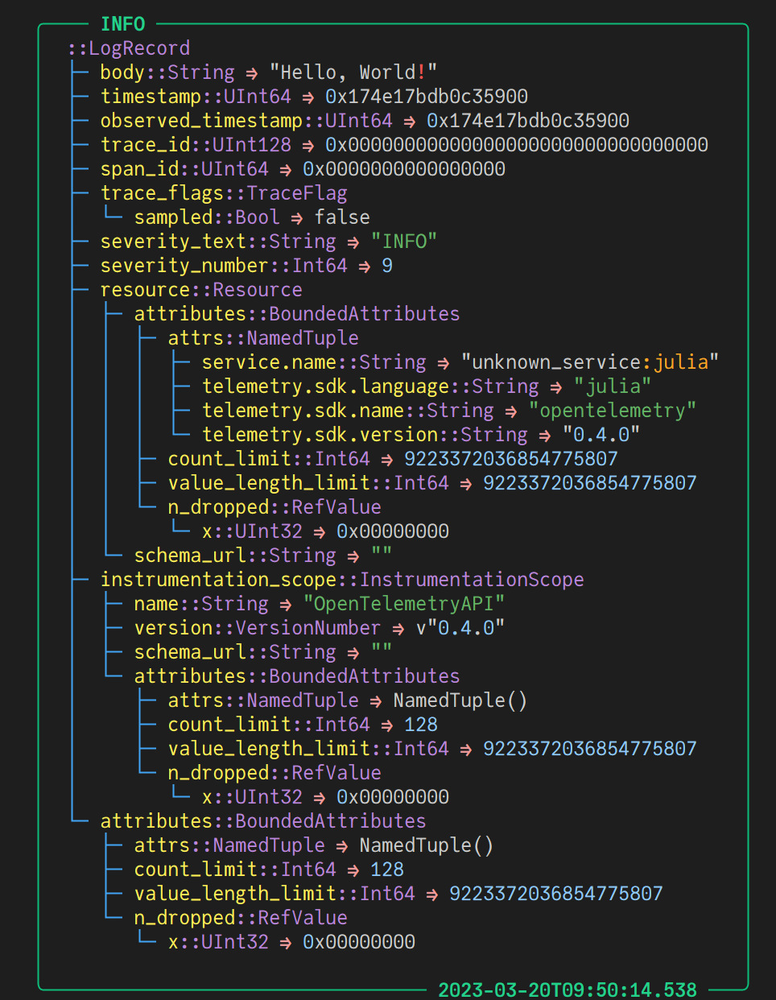
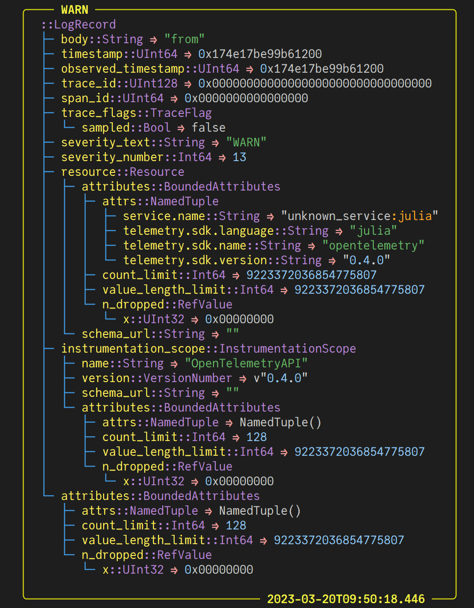
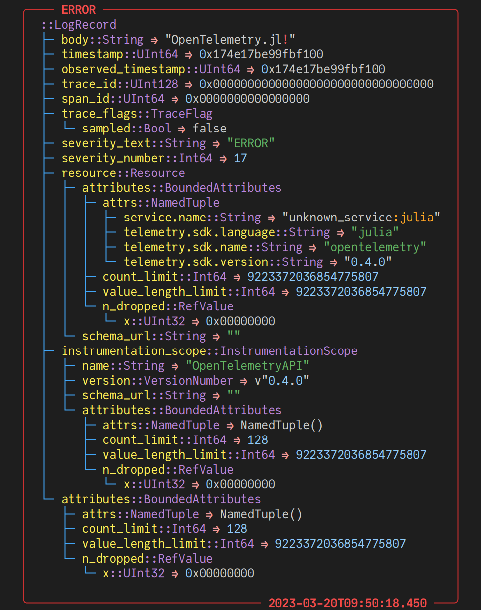
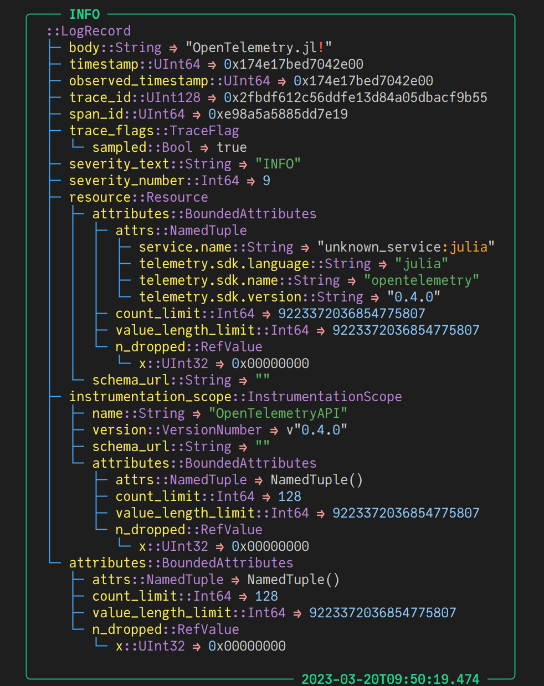
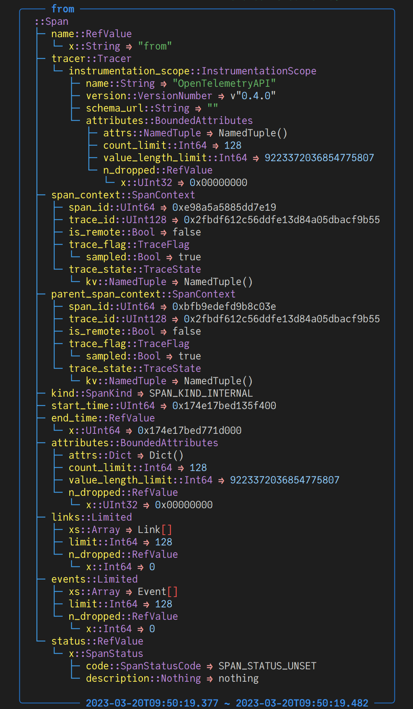
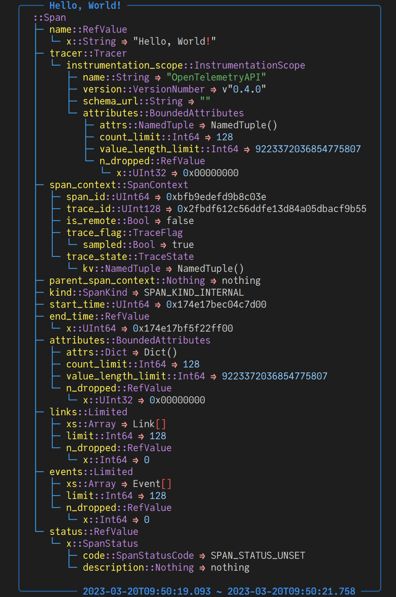
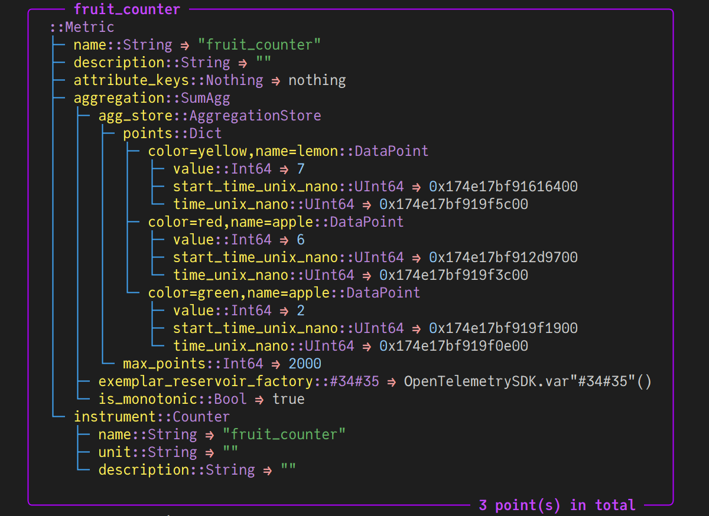

# OpenTelemetry.jl
[](https://oolong-dev.github.io/OpenTelemetry.jl/dev)
[](https://github.com/oolong-dev/OpenTelemetry.jl/actions/workflows/CI.yml)
[](https://codecov.io/gh/oolong-dev/OpenTelemetry.jl)
[](https://julialang.org/slack/)
[](https://github.com/SciML/ColPrac)


An *unofficial* implementation of [OpenTelemetry](https://opentelemetry.io/) in Julia.

## Get Started

### Logs

```julia
using OpenTelemetry
using Term # optional, for better display
using Logging

global_logger(OtelSimpleLogger());

@info "Hello, World!"
@warn "from"
@error "OpenTelemetry.jl!"
```



### Traces

```julia
global_tracer_provider(TracerProvider());

with_span("Hello, World!") do
    with_span("from") do
        @info "OpenTelemetry.jl!"
    end
end
```



### Metrics

```julia
global_meter_provider(MeterProvider());

m = Meter("demo_metrics");
c = Counter{Int}("fruit_counter", m);

c(; name = "apple", color = "red")
c(2; name = "lemon", color = "yellow")
c(1; name = "lemon", color = "yellow")
c(2; name = "apple", color = "green")
c(5; name = "apple", color = "red")
c(4; name = "lemon", color = "yellow")

r = MetricReader();
r()
```



## Tutorial

(WIP)

- [View Metrics in Prometheus](https://oolong-dev.github.io/OpenTelemetry.jl/dev/tutorials/View_Metrics_in_Prometheus)
- [View Metrics in Prometheus through Open Telemetry Collector](https://oolong-dev.github.io/OpenTelemetry.jl/dev/tutorials/View_Metrics_in_Prometheus_through_Open_Telemetry_Collector/)
- [View Metrics/Traces/Logs in Grafana/ElasticAPM](https://oolong-dev.github.io/OpenTelemetry.jl/dev/tutorials/View_Logs_Traces,_and_Metrics_Together_in_Grafana_ElasticAPM)
- An End-to-end Toy Example with Auto Instrumentation across Different Languages
- Case Study 1: Empower `Dagger.jl` with `OpenTelemetry.jl`
- Case Study 2: Empower `AlphaZero.jl` with `OpenTelemetry.jl`

## Tips for Developers

(WIP)

- Understand the Architecture of `OpenTelemetry.jl`
- How to Add Instrumentation to a Third-party Package?
- How to Extend `OpenTelemetrySDK`?
- Conventions and Best Practices to Instrument Your Application

## FAQ

Some frequently asked questions are maintained [here](https://oolong.dev/OpenTelemetry.jl/dev/FAQ/). If you can't find the answer to your question there, please [create an issue](https://github.com/oolong-dev/OpenTelemetry.jl/issues). Your feedback is **VERY IMPORTANT** to the quality of this package❤.


## Packages

| Package | Description | Latest Version |
|:--------|:------------|:---------------|
|[`OpenTelemetryAPI`](https://oolong.dev/OpenTelemetry.jl/dev/OpenTelemetryAPI/) | Common data structures and interfaces. Instrumentations should rely on it only. | [](https://juliahub.com/ui/Packages/OpenTelemetryAPI/p4SiN) |
| [`OpenTelemetrySDK`](https://oolong.dev/OpenTelemetry.jl/dev/OpenTelemetrySDK/) | Based on [the specification](https://github.com/open-telemetry/opentelemetry-specification/blob/main/specification/overview.md#sdk), application owners use SDK constructors; plugin authors use SDK plugin interfaces| [](https://juliahub.com/ui/Packages/OpenTelemetrySDK/NFHPX) |
| [`OpenTelemetryProto`](https://oolong.dev/OpenTelemetry.jl/dev/OpenTelemetryProto/) | See [the OTLP specification](https://github.com/open-telemetry/opentelemetry-specification/blob/main/specification/protocol/README.md). Note the major and minor version is kept the same with the original [opentelemetry-proto](https://github.com/open-telemetry/opentelemetry-proto) version.  | [](https://juliahub.com/ui/Packages/OpenTelemetryProto/l1kB4) |
| [`OpenTelemetryExporterOtlpProtoGrpc`](https://oolong.dev/OpenTelemetry.jl/dev/OpenTelemetryExporterOtlpProtoGrpc/) | Provide an `AbstractExporter` in OTLP through gRPC. (WARNING!!! This package is not updated to the latest version yet since `gRPCClient.jl` doesn't support `ProtoBuf.jl@v1` yet.) | [](https://juliahub.com/ui/Packages/OpenTelemetryExporterOtlpProtoGrpc/S0kTL) |
| [`OpenTelemetryExporterOtlpProtoHttp`](https://oolong.dev/OpenTelemetry.jl/dev/OpenTelemetryExporterOtlpProtoHttp/) | Provide exporters in OTLP through HTTP.|  |
| [`OpenTelemetryExporterPrometheus`](https://oolong.dev/OpenTelemetry.jl/dev/OpenTelemetryExporterPrometheus/) | Provide a meter to allow pulling metrics from Prometheus |[](https://juliahub.com/ui/Packages/OpenTelemetryExporterPrometheus/Xma7h) |
|`OpenTelemetry` | Reexport all above. For demonstration and test only. Application users should import `OpenTelemetrySDK` and necessary plugins or instrumentations explicitly. | [](https://juliahub.com/ui/Packages/OpenTelemetry/L4aUb) |

## Benchmarks

Check out the benchmark results of some essential operations with [Julia@v1.6](https://oolong-dev.github.io/OpenTelemetry.jl/benchmarks/Julia-v1.6/).
