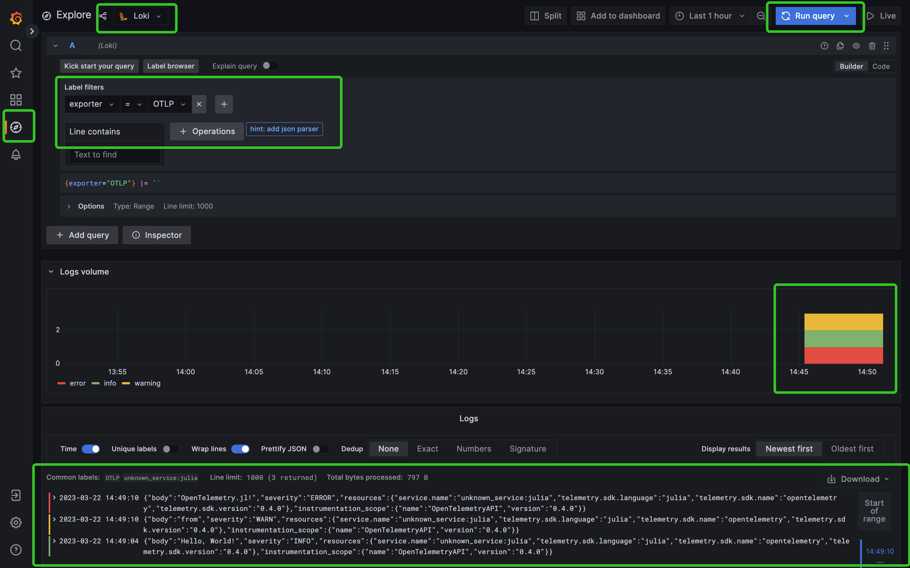

# Send Logs to Loki via OpenTelemetry Collector

Two loggers are provided by `OpenTelemetry.jl`, [`OtelSimpleLogger`](@ref) and [`OtelBatchLogger`](@ref). If you're familiar with the concepts in [LoggingExtras.jl](https://github.com/JuliaLogging/LoggingExtras.jl), those two loggers can be treat like *sink*s. In previous examples, we've learned how to print logs in the console.

```julia
using OpenTelemetry
using Term # optional, for better display
using Logging

global_logger(OtelSimpleLogger());

@info "Hello, World!"
@warn "from"
@error "OpenTelemetry.jl!"
```

To send logs to OpenTelemetry Collector, we can specify the exporter explicitly when initializing the `OtelSimpleLogger`.

```julia
global_logger(OtelSimpleLogger(exporter=OtlpHttpLogsExporter()))
```

The next step is to setup OpenTelemetry Collector, Loki and Grafana web portal to view the collected logs.

```bash
cd docs/src/tutorials/Send_Logs_to_Loki_via_OpenTelemetry_Collector
docker compose up
```

Again, let's log some messages in Julia:

```julia
@info "Hello, World!"
@warn "from"
@error "OpenTelemetry.jl!"
```

Now open Grafana ([http://localhost:3000/](http://localhost:3000/)) in your browser. You shold find the logs we just recorded as depicted below:



Similar to [`BatchSpanProcessor`](@ref), in practice, we usually send logs in batches instead of sending them immediately one-by-one.