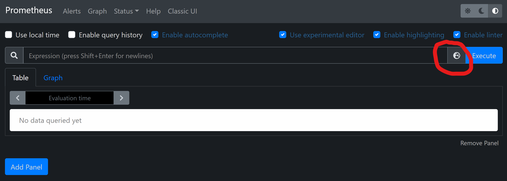

# View Metrics in Prometheus

Before learning how to view metrics in [Prometheus](https://prometheus.io/), let's take a close look at the example code in the [Get Started#Metrics](https://github.com/oolong-dev/OpenTelemetry.jl#metrics) section.

```julia
using OpenTelemetry
```

`OpenTelemetry.jl` is a meta package of several sub-packages. In practice, we'd import proper sub-packages based on the need. Here we simply import this meta package for tutorial purpose.

```julia
m = Meter("demo_metrics");
```

First, a [`Meter`](@ref) is defined with the name `"demo_metrics"`. A `Meter` is used to group several instruments together to measure some similar aspects of a system. In an application, you may create many different meters as you wish.

```julia
c = Counter{Int}("fruit_counter", m)
```

Then let's create an instrument of type [`Counter`](@ref) to count the number of fruits. A `Counter`, as the name indicates, is used to count the number of something. Each instrument must be associated with a [`Meter`](@ref) (the `m` here). Note that the parameter type `Int` indicates that we'll use an `Int` to represent the value. Although we can many other `Number` types in Julia, `Int` and `Float64` are the common ones supported by most Application Performance Monitoring (APM) systems.

```julia
c(; name = "apple", color = "red")
```

Each counter is a functional object. Now, let's say we've seen a red apple. We can call it directly without positional arguments, which implicitly means we've seen exactly **ONE** fruit. The two extra keyword arguments, `name` and `color`, define two dimensions of our fruit counter `c`. In theory, we can define a dedicated counter named `"red_apple_counter"`. But adding extra dimensions will help us perform some aggregations on the resulted metrics. We'll discuss the advantage in detail later.

```julia
c(2; name = "lemon", color = "yellow")
c(1; name = "lemon", color = "yellow")
c(2; name = "apple", color = "green")
c(5; name = "apple", color = "red")
c(4; name = "lemon", color = "yellow")
```

After adding more fruits. Now a question naturally arises, "How many fruits have we seen until now?" To answer this question, we need to create a [`MetricReader`](@ref).

```julia
r = MetricReader();
```

As you may noticed, a bunch of information is printed in the console. What we're most interested in is the `value` field of each entry in the `unique_points`. Could you confirm they are exactly the same with the fruits we've seen?

Now let's add some more fruits.

```julia
c(10; name = "lychee", color = "red")
c(8; name = "longan", color = "yellow")
c(3; name = "apple", color = "red")
```

To view all the fruits we've seen now, we can call the reader defined before, which is parameterless functional object.

```julia
r()
```

Although the information printed in the console is exhaustive, there're some better tools to visualize the metrics intuitively. And this introduces the topic of the tutorial, to view metrics in Prometheus.

To allow Prometheus communicate with metrics defined in `OpenTelemetry.jl`, we need to create another [`MetricReader`](@ref):

```julia
prometheus_reader = MetricReader(PrometheusExporter(; host = "0.0.0.0", port = 9966));
```

In the above code, we initialized a [`PrometheusExporter`](@ref) which listens to the port `9966` in the host environment. Now we just need to setup the Prometheus client. [The official Prometheus website](https://prometheus.io/docs/introduction/first_steps/#downloading-prometheus) documents it well on how to install and configure the Prometheus client. Personally, I'd usually use docker for this kind of quick experiments. Make sure you have [docker](https://docs.docker.com/engine/install/) and [docker-compose](https://docs.docker.com/compose/install/) properly installed on your system. We'll use them throughout all the tutorials. Keep your existing Julia REPL open and we'll come back to it soon. Now open another terminal, follow the following commands to clone this repo and setup the Prometheus.

```bash
git clone git@github.com:oolong-dev/OpenTelemetry.jl.git
cd docs/src/tutorials/View_Metrics_in_Prometheus
docker-compose up -d
```

Now open your browser and head to `127.0.0.1:9090`. You'll see the Prometheus portal.



Then click the icon near the **Execute** button to select the `fruit_counter`, and finally click the **Execute** button to execute the query. You'll see the metrics in the **Table** tab. Now switch to the **Graph** tab, you can see historical values of the fruit counter in each dimension. Come back to the Julia REPL. Try to add more fruits and see how the graph in the Prometheus portal changes.

In [the next tutorial](../View_Metrics_in_Prometheus_through_OpenTelemetry_Collector/), we'll learn more about [OpenTelemetry](https://opentelemetry.io/) and advanced metrics related usages.